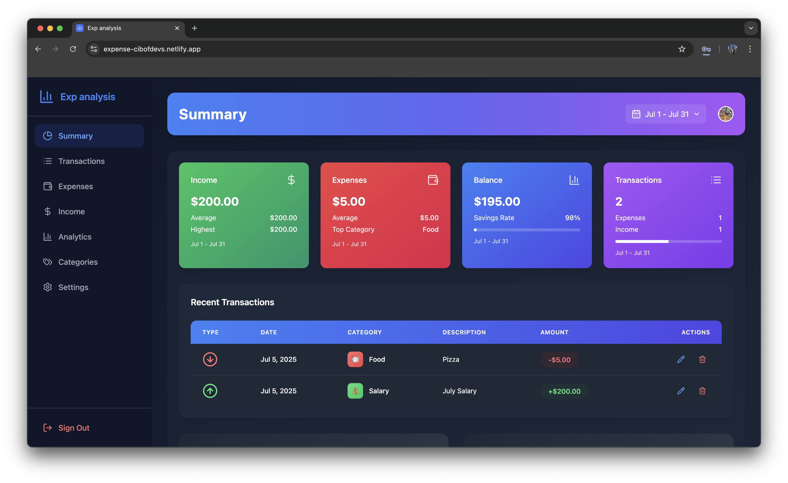

# Expense Tracker App
[](https://app.netlify.com/sites/expense-tracker/deploys)
[](https://github.com/cibofdevs/expense-tracker/actions/workflows/ci.yml)

A modern and intuitive expense tracking application built with React, TypeScript, and Supabase. Track your expenses, manage your budget, and gain insights into your spending habits with beautiful visualizations and a responsive UI.

## Preview


## Live Demo
Visit the live application at: [https://expense-cibofdevs.netlify.app](https://expense-cibofdevs.netlify.app)

## Features
- 📊 **Dashboard Overview**: Get a quick snapshot of your income, expenses, and savings
- 💰 **Budget Management**: Set and track budgets for different expense categories
- 📱 **Responsive Design**: Works seamlessly on desktop and mobile devices
- 🌙 **Dark Mode**: Support for light and dark themes
- 🔄 **Real-time Updates**: Instant synchronization of your financial data
- 📈 **Analytics**: Visual representation of your spending patterns
- 🌐 **Multi-currency Support**: Handle transactions in different currencies
- 🔒 **Secure Authentication**: Powered by Supabase authentication
- 🎯 **Category Management**: Organize expenses with customizable categories

## Tech Stack
- React
- TypeScript
- Tailwind CSS
- Supabase
- Chart.js
- React Router
- React Hot Toast
- Lucide Icons

## Getting Started

### Prerequisites
- Node.js (v14 or higher)
- npm or yarn
- Supabase account

### Installation
1. Clone the repository:
```bash
git clone https://github.com/cibofdevs/expense-tracker.git
cd expense-tracker
```

2. Install dependencies:
```bash
npm install
# or
yarn install
```

3. Create a `.env` file in the root directory and add your Supabase credentials:
```env
VITE_SUPABASE_URL=your_supabase_url
VITE_SUPABASE_ANON_KEY=your_supabase_anon_key
```

4. Start the development server:
```bash
npm run dev
# or
yarn dev
```

### Database Setup
1. Create a new project in Supabase
2. Run the following SQL commands in your Supabase SQL editor to set up the required tables:

```sql
-- Create tables (SQL will be provided in schema.sql file)
```

## Contributing
We welcome contributions! Please feel free to submit a Pull Request. For major changes, please open an issue first to discuss what you would like to change.

1. Fork the repository
2. Create your feature branch (`git checkout -b feature/AmazingFeature`)
3. Commit your changes (`git commit -m 'Add some AmazingFeature'`)
4. Push to the branch (`git push origin feature/AmazingFeature`)
5. Open a Pull Request

## License
This project is licensed under the MIT License - see the [LICENSE](LICENSE) file for details.

## Acknowledgments
- [Supabase](https://supabase.io/) for the backend infrastructure
- [Tailwind CSS](https://tailwindcss.com/) for the styling
- [Chart.js](https://www.chartjs.org/) for the charts and visualizations
- [Lucide](https://lucide.dev/) for the beautiful icons

## Support
If you find this project helpful, please give it a ⭐️ on GitHub!